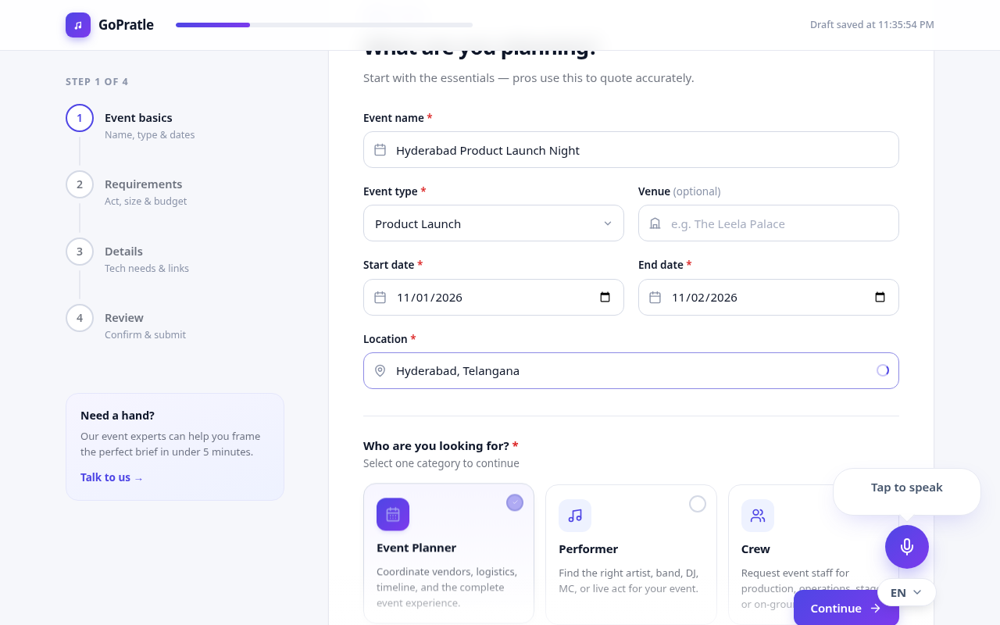
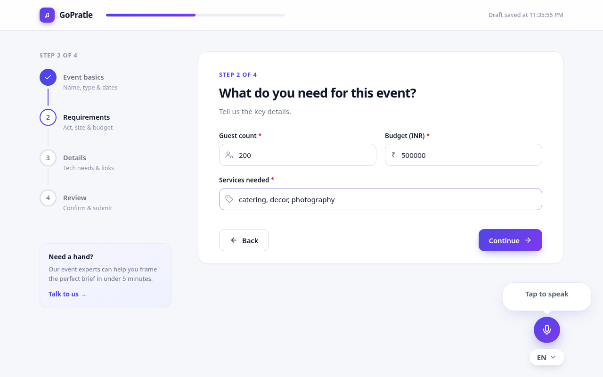
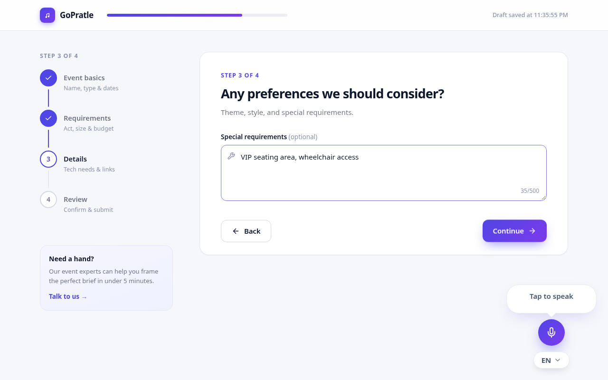
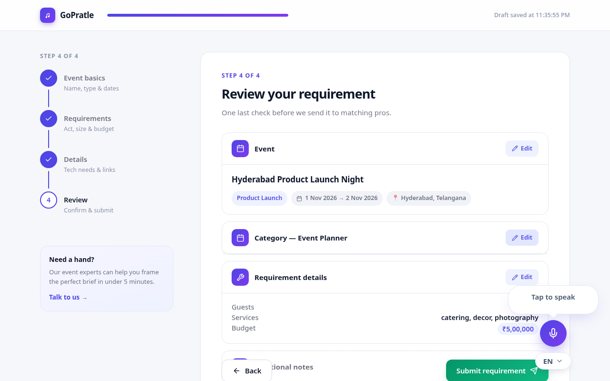
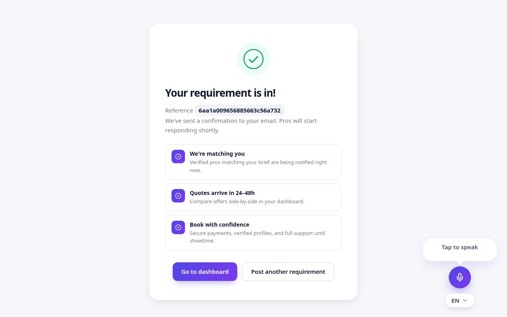

# GoPratle Requirement Posting Flow

Post event requirements as a planner, performer, or crew member — 4-step wizard, voice-first AI assistant, Express + MongoDB backend.

- **Live app:** https://gopratle-fullstack-assignment-web.vercel.app
- **API:** https://gopratle-fullstack-assignment.onrender.com
- **Demo video:** https://youtu.be/Vjp9DaZ2o2U

## What it does

- **4-step wizard** — Event Basics → Category Requirements → Details → Review & Submit, with per-step validation and auto-saved drafts
- **Category-aware fields** — planner, performer, and crew each get their own Step 2/3 fields, enforced by one shared Zod contract on client and server
- **Voice AI assistant** — mic button fills the form hands-free ("set budget to 75000", "next", "submit"), EN + Hindi; Groq LLM → OpenRouter fallback, Cartesia TTS → Sarvam fallback, quota-free local parsing for commands
- **Google Places autocomplete** — location suggestions proxied through the backend (key never hits the browser)
- **Secure API** — Helmet, CORS, rate limiting, request IDs, Zod error envelopes

## Screenshots

| Step 1 — Event Basics | Step 2 — Requirements |
|---|---|
|  |  |

| Step 3 — Details | Step 4 — Review |
|---|---|
|  |  |



## Quickstart

```bash
pnpm install
cp .env.example apps/api/.env   # add MONGODB_URI + provider keys
pnpm dev                         # web :3000, api :5000
```

| Package | Stack |
|---|---|
| `apps/web` | Next.js 15, React 19, Tailwind v4 |
| `apps/api` | Express 5, Mongoose 8, Zod |
| `packages/contracts` | Shared Zod schemas (single source of truth) |

## API

| Method | Route | Purpose |
|---|---|---|
| GET | `/api/v1/health` | Status |
| POST | `/api/v1/requirements` | Create requirement → `{id, category, status}` |
| GET | `/api/v1/requirements/:id` | Read one requirement |
| POST | `/api/v1/assistant/message` | Voice/bot reply + form action |
| POST | `/api/v1/assistant/speak` | Text → MP3 audio |
| GET | `/api/v1/places/autocomplete?input=` | Location suggestions |

```bash
# Create
curl -X POST https://gopratle-fullstack-assignment.onrender.com/api/v1/requirements \
 -H 'Content-Type: application/json' \
 -d '{"event":{"name":"Launch Night","type":"Concert","startDate":"2026-10-01","endDate":"2026-10-02","location":"Hyderabad"},"category":"performer","details":{"performanceType":"DJ","performerCount":2,"performanceDurationMinutes":120,"budget":75000}}'
```

## Env vars

| Variable | Required | Notes |
|---|---|---|
| `MONGODB_URI` | Yes | Atlas connection string |
| `FRONTEND_URL` | Prod | CORS origin |
| `NEXT_PUBLIC_API_BASE_URL` | Prod | API URL for the frontend |
| `GROQ_API_KEY` | For voice AI | Primary LLM |
| `OPENROUTER_API_KEY` | No | LLM fallback |
| `CARTESIA_API_KEY` | For voice | Primary TTS |
| `SARVAM_API_KEY` | No | TTS fallback |
| `GOOGLE_MAPS_API_KEY` | No | Places autocomplete (field works without it) |

## Deploy

- **API (Render):** Docker runtime, `./Dockerfile`, port 5000, add env vars above
- **Frontend (Vercel):** root `apps/web`, add `NEXT_PUBLIC_API_BASE_URL`
- **DB:** MongoDB Atlas M0 (free)

## Test

```bash
pnpm --filter @gopratle/api test      # 120
pnpm --filter @gopratle/web test      # 55
pnpm --filter @gopratle/contracts test # 26
```

See `docs/voice-pipeline.md` for the voice architecture.
